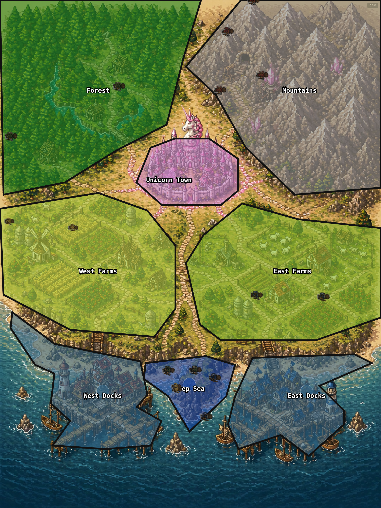

# ClanWorld — World Physics

**World physics** means *all the rules of the game engine* — the complete, precise description of how the ClanWorld simulation behaves: how time advances, how clansmen gather and carry resources, how missions are computed, how movement, winter, bandits, and trade work, and every rate, probability, capacity, and cooldown that governs the world. If a behavior affects the game state, it belongs here.

This document is **human-facing and forward-looking**. The current on-chain (smart-contract) engine is being retired — its rules are being lifted into this spec so they can be re-implemented in a normal backend (or Solana) game engine without carrying over the gas/complexity baggage. So this is the canonical statement of *what the game should do*; the existing contract is treated as the reference implementation we extract rules from, not as the permanent home of those rules. An agent-facing rewrite (tuned for the Elder prompts/CLI) will be derived from this later.

**Status: 🚧 Being built collaboratively, one section at a time.** Treat unverified sections as drafts, not ground truth.

> ⚠️ **All numeric values in this doc are subject to change.** They are the current engine's tuning, not fixed law — expect them to be re-balanced (especially in the new engine).

---

## How this document is built

A **spec-alignment exercise**. For each section:

1. **Liam states the intended behavior** from his mental model of the design.
2. **Subagents read the reference engine code** (the current contract under `packages/contracts`) and verify each value, citing the source.
3. We **reconcile** — where code and intent disagree, that gap is a doc fix, a deliberate design decision for the new engine, or a known quirk of the old engine we choose to drop. Each resolved value is marked with its source.

### Verification legend

| Mark | Meaning |
|---|---|
| ⬜ | Not started |
| 📝 | Liam's intended model captured — not yet code-verified |
| 🔎 | Subagent verifying against the reference engine |
| ✅ | Verified against engine code (source cited) |
| ⚠️ | Code disagrees with intent — note / decision needed |
| 🆕 | Intended behavior for the NEW engine (may differ from the old contract) |

---

## Section map

> Ordered roughly by dependency (each builds on the ones above), but we can fill them in any order. Liam's first-pass mental model is captured inline as 📝 seeds.

### 1. Overview & core entities
_Status: ⬜_ — Clans, clansmen, regions, the world; the tick-driven loop at a glance. Orientation for everything below.

### 2. Time — ticks, heartbeats & seasons
_Status: ✅ verified against `packages/contracts/src/IClanWorld.sol`_

The **tick** is the atomic unit by which game *state* advances — gathering, settlement, consumption, travel, and most durations are counted in ticks. (A few constraints run on a separate **wall-clock** timer instead — notably the per-clansman mission cooldown, a 60-second clock that is independent of tick boundaries; see §4.)

- **Tick / heartbeat** — the world advances exactly one tick per **heartbeat**, fired every **60 seconds** (`HEARTBEAT_INTERVAL_SECONDS = 60`). The interval is configurable up to 1 hour (`HeartbeatConfigFacet`), but 60s is the canonical cadence.
- **Season** — one game is a **season** of **360 ticks** (`SEASON_DURATION_TICKS = 360`) = **6 hours** at the 60s heartbeat. Seasons are numbered; at the boundary the old season is finalized and the next begins (`FinalizeSeasonFacet`).

**Recurring events** (tick-interval triggers):

- **Winter** — a recurring cold period: starts at tick 110, lasts 10 ticks, so the **first winter completes at tick 120**; it then recurs every **110 ticks** (`WINTER_START_TICK = 110`, `WINTER_PERIOD_TICKS = 110`, `WINTER_DURATION_TICKS = 10`; same in the runner `gameSettings`). Conceptually each cycle is a "year" that culminates in a winter (the first such year ends at ~tick 120). Mechanics in §6.
- **Memory wipe** — every **50 ticks** (`memoryWipeTickInterval = 50`) each Elder agent's context window is wiped, forcing it to rely on its memory tools (e.g. `ANCIENT_WISDOM.md`) to carry strategy forward. This is an **agent-layer** mechanic — driven by the runner (which warns the agent 5 and 1 ticks ahead), not an on-chain engine event.

_What the heartbeat resolves each tick (mission settlement, consumption, season transitions) is described in the relevant sections (§4, §6) rather than duplicated here._

### 3. Regions & travel
_Status: ✅ verified against `IClanWorld.sol` + `LibTravel.sol`_

**8 regions** (`gotoRegion` IDs): **1** Forest · **2** Mountains · **3** Unicorn Town · **4** West Farms · **5** East Farms · **6** West Docks · **7** East Docks · **8** Deep Sea. `gotoRegion: 0` = **REGION_NOOP** — stay put / no move (a known footgun: 0 is *not* "home").

**Travel** — adjacent regions are **1 tick** apart. Longer trips follow a **fixed shortest path** through the adjacency graph (deterministic BFS over a precomputed `distMatrix`), **1 tick per hop**, up to a max of **4 ticks** across the map (e.g. Forest → East Docks). Because the path is deterministic, the engine can compute a clansman's **exact location mid-travel** — which is precisely what makes lazy re-dispatch work: re-tasking a clansman while it's still travelling, the engine knows where it is on the path. *(Contrast §5: interrupted **gathering** loses partial progress, but travel **position** is always known.)*

**Map shape** (adjacency): Forest ↔ Mountains ↔ Unicorn Town form the core; Unicorn Town links the two Farms; each Farm leads to its Dock; **Deep Sea is reachable only via the Docks (6/7)** — so deep-sea fishing (the best odds, §5) requires travelling out through a dock.

### 4. Missions
_Status: ✅ verified against `IClanWorld.sol` + `LibSubmitOrders`/`LibSettlement`_

A mission is intentionally simple — a **3-tuple: `(clansmanId, gotoRegion, action)`** = "go to this region, do this action" (`ClanOrder`). A few actions carry extra params: `targetClanId` (DefendBase), `marketToken`/`marketAmount`/`maxGoldIn` (MarketBuy/Sell), `withdrawResources` (Withdraw).

**Action set** (`ActionType`):
- **Gather** (4 ticks): ChopWood · MineIron · FishDocks · FishDeepSea · HarvestWheat
- **Logistics** (1 tick): DepositResources · WithdrawResources
- **Build** (1 tick): UpgradeWall · UpgradeBase · UpgradeMonument
- **Other**: DefendBase · MarketBuy · MarketSell · Wait (idle)

A mission first **travels** to `gotoRegion` (1 tick/hop, §3), then performs the action.

**Lazy, deterministic settlement** ✅ — the engine doesn't tick every clansman live. Whenever an elder submits a new order, `submitClanOrders` first calls `_settleClan`, which replays the clan forward **one tick at a time** from its `lastSettledTick` to now, resolving each clansman's actions and **persisting gathered resources + state on-chain**. Outcomes (wood crit, fish/gold rolls) are **deterministic**, seeded from the per-tick heartbeat seed (`tickSeeds[tick]` / `currentTickSeed`) — fixed once the heartbeat sets the seed, just computed on demand. (Settlement also runs on heartbeat/winter/season events; a `MAX_LAZY_SETTLE_BACKLOG` cap means a clan left unsettled too long must be settled before it can take new orders.)

- An order **replaces** that clansman's current mission — an agent may re-plan at any time (mid-travel, mid-gather, or once idle). ⚠️ *Caveat (§5): re-planning mid-gather loses the partial 4-tick batch (0 wood at tick 2 of a chop); travel position, by contrast, is always preserved (§3).*
- **Submission cooldown** ✅ — a **per-clansman 60-second wall-clock** throttle on new submissions (`CLANSMAN_COOLDOWN_SECONDS = 60`; enforced via `cooldownEndsAtTs`, a **timestamp** — NOT a tick boundary; configurable up to 1h; orders inside it revert with `ERR_COOLDOWN_ACTIVE`). The 60s is *meant to match* the tick duration so an agent can submit a clansman **at most ~once per tick**, but it is a distinct clock, not gated on the tick boundary. **Purpose:** since missions can be changed mid-flight, the cooldown limits dispatch frequency to force agents to plan command timing rather than spam re-submissions.

### 5. Resources & gathering
_Status: ✅ core verified (carrying, vault/carried, gathering) against `IClanWorld.sol` + `LibSettlement.sol`_

**Resource types:** wood, iron, wheat, fish (gatherable) + **gold** + **blueprints**.

- **Gold** ✅ — the base currency for all Unicorn Town trading. Earned ~2% of the time when mining iron (§5 gathering).
- **Blueprints** ✅ — needed **only** for the **monument** at **L6+** (1 per level; walls and base never require them). Clans start with **0**; transferable between clans (`transferBlueprint`). *(Earning path beyond transfer: to confirm.)*

**Starting vault** ✅ (`ClanLifecycleFacet`) — a fresh clan begins with **20 wood, 20 wheat, 2 fish, 3 gold** (0 iron, 0 blueprints), 4 clansmen. ⚠️ *Liam recalled an empty vault — it's actually stocked as above.* The 20 wheat + 2 fish covers only ~5 ticks of upkeep (4 wheat + 0.4 fish/tick for 4 clansmen) before starvation. 🆕 *Intended: raise starting food to ~**50 wheat + 5 fish** (~12 ticks of buffer) so a fresh clan has breathing room.*

**Carrying capacity — per-resource, not a combined total** ✅ (`IClanWorld.sol`). Each clansman has an independent cap per resource (a "backpack" / wheelbarrow); the slots fill separately:

| Resource | Carry cap |
|---|---|
| Wood | 15 (`WOOD_CAP`) |
| Iron | 5 (`IRON_CAP`) |
| Wheat | 40 (`WHEAT_CAP`) |
| Fish | 8 (`FISH_CAP`) |

Because caps are per-resource, one clansman can top up **every** resource (across regions) before a single deposit trip — more efficient than one-resource round-trips — and can carry a **mix**, useful for travelling to Unicorn Town or for emptying the vault to shield resources from bandit looting.

**Vault vs. carried** ✅ — two distinct pools with different uses:
- **Carried** (on the clansman; `carryWood/Iron/Wheat/Fish`): the **only** resources usable on the **Unicorn Town spot market** (`LibOrderMarket` trades against `cs.carry*`). To trade on the spot market a clansman must either have just gathered, or fill its backpack at home base first.
- **Vault** (the clan's deposited store): usable for **OTC trades + clan-to-clan transfers** (`transferVaultResource`, `transferGold`) — but **not** the Unicorn Town spot market.

**Gathering** ✅ (`IClanWorld.sol` + `LibSettlement.sol`) — every gather action runs **4 ticks** (`actionDuration = 4`) and pays out at settlement; deposit/withdraw/build = 1 tick. Yields are capped at the per-resource carry cap, and **starvation halves all gather yields** (`amount / 2`).

| Action | Base rate | Per 4-tick gather | Notes |
|---|---|---|---|
| Chop wood | 1/tick (`WOOD_YIELD_PER_TICK`) | 4 wood | **10% crit** (`WOOD_CRIT_BPS = 1000`) **doubles** the yield (→8) |
| Mine iron | 0.125/tick (`IRON_YIELD_PER_TICK`) | 0.5 iron | **2%** chance (`GOLD_FROM_IRON_BPS`) of also finding **1 gold** |
| Harvest wheat | 5/tick (`WHEAT_YIELD_PER_TICK`) | up to 20 wheat | drawn from a **wheat plot** (100 cap, `WHEAT_PLOT_STARTING_WHEAT`); depleting it triggers a **4-tick regrow** |
| Fish — docks | probabilistic | **25%** chance of 1 fish (`FISH_DOCKS_BPS`) | east/west docks |
| Fish — deep sea | probabilistic | **75%** chance of 1 fish (`FISH_DEEP_BPS`) | no boat gate yet — deep sea just has better odds |

⚠️ **Gather resolution — code vs intent (important).** The code settles gathers in **4-tick batches**: a clansman's carry updates only when the 4-tick mission settles (`settlesAtTick = tick + 4`), computing `rate × 4` in one lump with a **single** crit roll that **doubles the whole batch** (wood 4 → 8; `amount *= 2`, constant comment *"multiplicative … not additive"*). 🆕 *Intended (Liam): gathering should resolve **per-tick** — each tick the carry grows by that tick's yield (so time-to-fill a backpack varies with the resource's probability), and crit is **per-tick** (a crit tick adds **+1**, so a 4-tick gather with one crit = **5 wood**, not 8). The 4-tick batch resolution should become per-tick in the new engine.*

This applies to **all gather actions** (wood/iron/wheat/fish all use `actionDuration = 4`), not just wood. Settlement itself **is lazy/on-dispatch** — `submitClanOrders` calls `_settleClan` before applying a new order (matching the intended "resolve on dispatch / bandit / winter" trigger), and gathering re-settles every 4 ticks until the carry cap. **But** because credit only lands at each 4-tick boundary, an interrupted gather **loses its partial progress**: re-dispatching a clansman **2 ticks into** a 4-tick wood chop credits **0 wood** (the boundary was never reached); interrupting at tick 6 credits 4 wood (one completed batch) and loses the 2 partial ticks. 🆕 *Intended (per-tick): those 2 ticks would credit 2 wood. This partial-loss is a direct consequence of the batch model and should disappear once gathering is per-tick.*

**Wheat plots** ✅ — each clan has **its own 2 plots** (west + east; `wheatPlots[clanId][2]`), 100 wheat each → **no contention between clans**.
- **Regrow (current):** a plot must be **fully depleted** (remaining → 0) before it enters a **4-tick regrow** back to 100; it does **not** partially/continuously regenerate, and can't be harvested while regrowing.
- **Winter:** when winter starts all plots become **`WinterLocked`** with `remainingWheat = 0` — **wheat cannot be harvested during winter** (effectively the crop dies). When winter ends, every plot **restarts fresh**: it does **NOT** remember its pre-winter amount — it enters a 4-tick regrow from 0, then becomes harvestable at full 100. (`LibWorldEvents.lockWheatPlotsForWinter` / `restartWheatPlotsAfterWinter`.)

🆕 **New-engine intent (Liam):**
1. **Continuous regrow** — a plot should begin regrowing **as soon as any portion is harvested**, rather than waiting for full depletion. The deplete-first rule is too subtle a nuance for the current agents and complicates the mental model. *(Also a graphics opportunity: render real plots on the map showing the harvest + multi-stage growth life-cycle so you can see how much is cut vs ready.)*
2. **Planting (later version)** — eventually require **planting** wheat before it grows (the original design), but it's a big mechanic; deferred so as not to overload the agents while they're still learning the basics.

⚠️ *vs Liam's recall:* wood is **1/tick, not 2**; crit chance is **10%, not 30%**. Iron's **0.5 is per-gather (4 ticks) = 0.125/tick**; gold-from-iron **2% / 1 gold — exact ✅**. Wheat **5/tick ✅**, but the **field-capacity/plot mechanic IS implemented** (100 per plot + 4-tick regrow), not postponed. Fish docks are **25%, not 5%**; deep sea **75% ✅**.

### 6. Consumption, starvation, winter & cold damage
_Status: ✅ verified against `IClanWorld.sol` + `LibSettlement.sol`_

**Food upkeep** — per clansman, per tick, drawn **only from the vault** (carried resources never count toward upkeep): **1 wheat + 0.1 fish** (`WHEAT_UPKEEP_PER_CLANSMAN = 1`, `FISH_UPKEEP_PER_CLANSMAN = 0.1`).

**Starvation** — triggers if the vault lacks **either** wheat **or** fish for the tick's upkeep. Effect: **all gather yields halve** (`amount/2`). It's the incentive to keep the vault stocked so clansmen work at full efficiency. (In winter, starvation also feeds clansman death — below.)

**Winter** (the recurring cold period from §2) raises the stakes two ways:
- **Food upkeep doubles** (`WINTER_UPKEEP_MULTIPLIER_BPS = 20000`) → 2 wheat + 0.2 fish per clansman/tick.
- **Wood burns for warmth** (winter only): **0.5 wood per clansman + 1 wood per base, per tick** (`WINTER_WOOD_BURN_PER_CLANSMAN = 0.5`, `WINTER_WOOD_BURN_PER_BASE = 1`), from the vault.

**Cold-damage cascade** — when the vault can't cover the winter wood burn, `coldDamage` accrues and consequences hit **in order** (`COLD_DAMAGE_PER_WALL_DEGRADATION = 2`, `COLD_DAMAGE_PER_CLANSMAN_DEATH = 2`):
1. **Walls degrade first** — every 2 points of cold damage strips 1 wall level (walls are effectively burned for warmth). ~2 ticks per wall level.
2. **Then clansmen die** — once walls hit 0, every further 2 points kills 1 clansman (~1 death per 2 ticks).

So a winter wood shortage eats your walls before it kills anyone — a buffer — but once walls are gone, deaths come fast. Death is permanent. ⚠️ *There is **no separate non-lethal "freezing" state** in the code (Liam recalled one); it's a direct threshold cascade: wall loss → death.*

### 7. Building, upgrades & winning
_Status: ✅ verified against `LibGameRules.sol` + `LibScoring.sol`_

Three structures can be upgraded (each upgrade is a **1-tick** action consuming vault resources):

**Walls** — defense vs bandits (absorb damage; see §8). Cost per level: L0→1 **20 wood**; L1→2 **35 wood**; L2→3 **30 wood + 5 iron**; L3→4 **40 wood + 10 iron**; L4→5 **50 wood + 15 iron**. (Low levels wood-only, higher add iron — as Liam recalled.)

**Base** — grants defensive HP (~25/level). Cost (from level): L1→2 40W + 20wheat; L2→3 60W + 5I + 30wheat; L3→4 80W + 10I + 40wheat; L4→5 100W + 15I + 50wheat (wood + wheat, iron higher). 🆕 *Intended but NOT implemented: a base upgrade was meant to unlock a bonus (5th+) clansman. Today the count is **hard-capped at 4** regardless of base level — to be added with the new engine.*

**Monument** — **the win objective.** Cost climbs from 30W + 20wheat (L0→1) to 200W + 25I + 100wheat + **1 blueprint** per level at L6→10 (wood + wheat throughout, iron from L2, blueprint from L6).

**Win condition** — at season end (`FinalizeSeasonFacet` + `LibScoring`), clans rank by:
1. **Highest monument level** (dominant), then
2. **earliest** to reach that level, then
3. **most loot** (weighted: wood + wheat + 2×fish + 4×iron), then
4. **highest wall level**, then
5. lowest clan ID.

So the game is: build the tallest monument, fastest. Tiebreaks reward speed, then hoarded resources, then defense.

### 8. Bandits, the path & defense
_Status: ⬜_
- 📝 Bandits, **the path**, and **defense** (walls absorb damage — costs in §7; base adds HP).
- 📝 **Bandit protection** — including how winter affects it.

### 9. Trading & economy
_Status: ✅ verified against `LibOrderMarket` / `StubPool` / `LibDirectTransfers`_

Two ways to move resources between clans:

**A. OTC / direct transfer** ✅ — `transferVaultResource` + `transferGold` move vault resources or gold clan-to-clan instantly. **No escrow, no forced settlement, no on-chain record of promises** — intentional, so elders must *learn to trust each other* when hiring, bribing, or negotiating deals. Guards: owner-only; both clans force-settled to the current tick first (else `ERR_MUST_SETTLE_FIRST`); sender alive; can't transfer resources reserved for a pending upgrade.

**B. Unicorn Town spot market** ✅ — a **Uniswap-v2 constant-product (x·y = k) AMM**, one pool per resource (wood/wheat/fish/iron, each paired with gold). Currently "stub" pools (`StubPool`) — but they're *real*, **fee-less** constant-product pools (no 0.3% fee; ClanWorld is the sole swapper). The new engine keeps the x·y=k model. Pool seeds set starting prices (iron most gold-expensive, then fish).

To trade, a clansman must be **in Unicorn Town (region 3)** with the resource **in its backpack** (sell) or carry headroom (buy):
- **Sell**: `marketAmount` = resource **amount-in** (exact-input). ⚠️ *No slippage protection — there's no min-gold-out, so a scheduled sell can be sandwiched.*
- **Buy**: `marketAmount` = resource **amount-out** (exact-output); `maxGoldIn` = the (required) gold slippage cap. A buy fails if it would exceed carry cap (`ERR_CARRY_FULL`), exceed `maxGoldIn`, or the vault lacks gold.

**Gold is global** — it lives in the clan vault (`goldBalance`); clansmen never carry gold to/from town. Only **resources** flow through the backpack and count against per-resource carry caps (§5).

**Two timings — and the intentional front-run window:**
- **Travel-then-trade (one mission):** "go to Unicorn Town (3) + MarketBuy/Sell." The clansman travels (≥1 tick); the trade **resolves at the arrival tick's settlement** (market actions have 0 duration). The amount + cap are **committed publicly** at submit time, but the price is whatever the pool is at the arrival tick — so a clansman **already camped in town can front-run it**. Intentional.
- **Camp-then-trade-immediately (manual):** park a clansman in Unicorn Town with **Wait** (full backpack). While idle in town, a MarketBuy/Sell **executes immediately** (same tx). For an in-place trade pass `gotoRegion = 3` — *not* 0 (NOOP works only because it normalizes to the current region, which must already be 3).

This enables **arbitrage / camping**: keep a stocked clansman waiting in town; when you see another clan's clansman en route to trade, sell ahead of them, let their trade move the price, then buy back cheaper. Within a settlement tick, scheduled orders execute deterministically in commit (FIFO) order.

🆕 **New-engine intent (Liam):** when *buying*, if the requested amount-out exceeds carry cap, **burn the excess** (the agent just wastes gold) rather than failing the whole trade. Today it **fails** (`ERR_CARRY_FULL`, gold refunded) — burn-on-overflow is not implemented.

### 10. Communications
_Status: ⬜_ — Elder-to-elder + public messaging (the layer trade/alliance negotiation rides on).
- 📝 **Whispers** — private point-to-point messages between two elders (`elder peer whisper` / inbox).
- 📝 **Bulletins** — public broadcast messages.
- 📝 How messages are delivered/stored, any rate limits, and how this ties to OTC trust-building (§9).

### 11. Open questions / disputed values
_Status: ⬜_ — Running list where intent and the reference code disagree, pending resolution.

---

## Change log

| Date (ET) | Section(s) | Change |
|---|---|---|
| 2026-05-25 | — | Scaffold + intro; restructured around Liam's section list (forward-looking spec for the replacement engine). Captured Liam's first-pass mental model as 📝 seeds. |
| 2026-05-25 | §2 Time | Filled + ✅ verified vs `IClanWorld.sol`: 60s heartbeat, 360-tick/6h season, winter recurrence. Added global "numbers subject to change" note. |
| 2026-05-25 | §2/§4 | Corrected §2 over-claim (not everything is tick-based); added recurring events (winter ⚠️110-vs-120, memory-wipe=50 agent-layer); §4 submission cooldown ✅ verified (per-clansman 60s wall-clock `cooldownEndsAtTs`, not tick-gated). |
| 2026-05-25 | §2/§5 | Winter reframed (no discrepancy — completed-winter mark at 120, period 110). §5 carrying ✅ (per-resource caps W15/I5/Wh40/F8) + vault-vs-carried ✅ (spot market = carried via LibOrderMarket; vault = OTC/transfer). Gathering rates queued. |
| 2026-05-25 | §5 | Gathering ✅: 4-tick gathers; wood 1/tick +10% crit-doubles; iron 0.125/tick +2% gold(1); wheat 5/tick from 100-cap plots w/ 4-tick regrow (field-cap IS implemented); fish prob 25% docks / 75% deep, 1 fish/success; starvation halves yields. Corrected Liam's recall (wood 1 not 2, crit 10 not 30, fish docks 25 not 5). |
| 2026-05-25 | §6/§7 | §6 ✅ consumption (1wheat+0.1fish/clansman from vault, winter 2x, winter wood 0.5/clansman+1/base) + cold cascade (walls degrade @2 dmg then deaths @2 dmg; NO freezing state). NEW §7 Building+winning ✅ (wall/base/monument costs; bonus-clansman 🆕 NOT impl, 4-cap; win = monument lvl→time→loot→wall→clanID). Renumbered bandits→8, trading→9, open-q→10. |
| 2026-05-26 | §4/§9/§10 | §4 Missions ✅ (3-tuple, action set, lazy deterministic settlement). §9 Trading ✅ (OTC no-escrow/no-promises; real fee-less x·y=k stub AMM; travel-vs-immediate trade + intentional front-run window; gold global/vault; buy=amount-out+maxGoldIn, sell=amount-in w/ NO slippage protection; buy-overflow FAILS, 🆕 burn-excess intent). Added §10 Communications stub; Open-questions → §11. |
