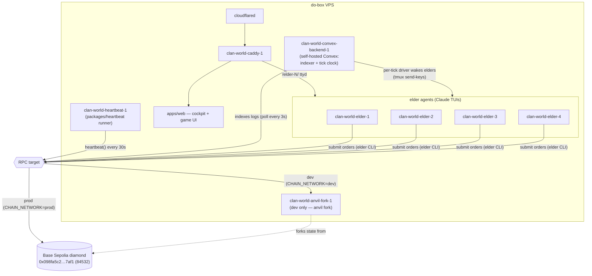
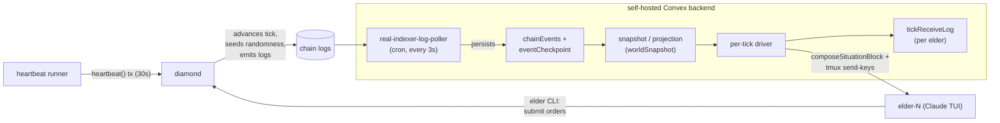
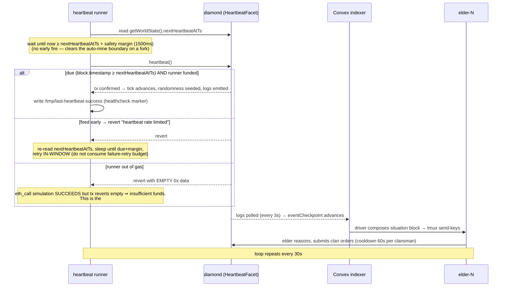

# ClanWorld — current architecture

**BLUF:** ClanWorld runs as a set of Docker containers on the do-box VPS. A
dockerized **heartbeat runner** fires `heartbeat()` every **30 seconds** against
an **EIP-2535 diamond** on **Base Sepolia** (`0x098fa5c2dc8372cde5c99db47365fa84b69f7af1`,
chainId **84532**). A **self-hosted Convex backend** indexes the chain logs and
drives a per-tick pipeline that wakes **four dockerized elder agents**, who
submit their clans' orders back on-chain. Local dev runs against an **anvil fork**
of Base Sepolia instead of the live chain.

This doc is the current-truth picture. If another doc contradicts it (e.g. says
"60s ticks", an external keeper, or external sponsor memory storage), that doc
is stale — see [../index.md](../index.md).

## Key facts

| Fact | Value |
|---|---|
| Chain | Base Sepolia, chainId `84532` |
| Diamond (proxy) | `0x098fa5c2dc8372cde5c99db47365fa84b69f7af1` |
| Contract shape | **EIP-2535 diamond** — selectors route to small facets. There is **no monolithic `ClanWorld.sol`** deployed; reason about behavior via the facets / `DiamondLoupeFacet`, not the `ClanWorld.sol` source stub. |
| Heartbeat interval | **30s** (`heartbeatIntervalSeconds()` on-chain; owner-settable via `setHeartbeatIntervalSeconds(uint64)` on `HeartbeatConfigFacet`). |
| Gather yields | **2x** (doubled WOOD/IRON/WHEAT/FISH) — inlined in `LibSettlement`; changing them needs a recompile + diamondCut REPLACE, not a runtime setter. |
| Convex | **Self-hosted** backend container `clan-world-convex-backend-1`, not Convex Cloud. |
| Elders | 4 Claude TUIs in `clan-world-elder-1` .. `clan-world-elder-4`. |
| Heartbeat runner | `clan-world-heartbeat-1` (source: `packages/heartbeat`). |
| Dev chain | `clan-world-anvil-fork-1` — an anvil fork of Base Sepolia (still reports chainId `84532`). |
| Memory backend | Interim **file-backed** stores (`FileMemoryStore`, `FilePeerInbox`). **Walrus Memory** (encrypted agent memory on Sui) is the planned next backend, replacing the retired sponsor memory/iNFT integration. |

### Deployed facets (from the loupe)

`AdminRecoveryFacet`, `BanditViewsFacet`, `BlueprintTransferFacet`,
`BundleTransferFacet`, `ClanFullViewFacet`, `ClanLifecycleFacet`,
`ClanOwnershipFacet`, `DerivedViewsFacet`, `DiamondCutFacet`,
`DiamondLoupeFacet`, `DirectTransfersFacet`, `FinalizeSeasonFacet`,
`GoldTransferFacet`, **`HeartbeatConfigFacet`** (interval/cooldown setters),
**`HeartbeatFacet`** (the `heartbeat()` tick), `MarketViewsFacet`,
`OwnershipFacet`, `QuoteViewsFacet`, `RawBanditViewsFacet`, `RawClanViewsFacet`,
`RawTreasuryViewsFacet`, `RawWorldViewsFacet`, `RegionViewsFacet`,
`ScoringViewsFacet`, `SettlementFacet`, `SnapshotViewsFacet`,
**`SubmitOrdersFacet`** (elder order submission), `TreasuryFacet`,
`VaultResourceTransferFacet`, `WorldPauseFacet`.

> Verify live: `cast call <diamond> 'facets()((address,bytes4[])[])' --rpc-url <rpc>`.

## (1) Container topology

In **dev**, the heartbeat runner / Convex indexer / elders all point at
`clan-world-anvil-fork-1` (`DEV_RPC_URL=http://anvil-fork:8545`). In **prod**
they point at live Base Sepolia (`PROD_RPC_URL`). The container picks the RPC
from `CHAIN_NETWORK` (`dev` | `prod`).

## (2) On-chain ↔ Convex ↔ elder data flow

The Convex indexer registers three crons (see `apps/server/convex/INDEXER.md`):
`real-indexer-log-poller` (every 3s, persists `chainEvents`/`eventCheckpoint`),
`real-indexer-snapshot-refresh-fallback` (every 60s), and
`real-indexer-poller-watchdog` (every 60s, reads the `pollerHealth` singleton).
`eventCheckpoint` is the indexer's high-water block; `tickReceiveLog` records the
last tick each elder was driven with.

## (3) Heartbeat tick lifecycle

> **Fork caveat:** on the anvil fork, `block.timestamp` does **not** track
> wall-clock on its own — it advances per mined tx / explicit time-jump. A naive
> "fire when wall ≥ target" scheduler can hot-loop (fire → revert → fire) while
> chain time stays below target. The runner handles this on the fork; details +
> the full #652 root-cause are in [../runbooks/heartbeat-runner.md](../runbooks/heartbeat-runner.md).

## Related

- [../runbooks/fresh-session-checklist.md](../runbooks/fresh-session-checklist.md) — verify all of the above against live state.
- [../runbooks/heartbeat-runner.md](../runbooks/heartbeat-runner.md) — heartbeat ops + failure modes.
- [diamond-pattern.md](diamond-pattern.md) — EIP-2535 design rationale.
- `apps/server/convex/INDEXER.md` — indexer crons + `eventCheckpoint` semantics.
